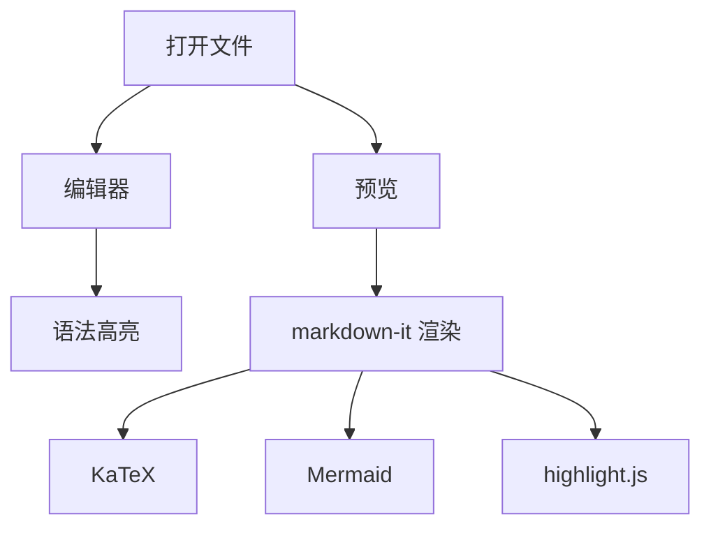

# QMark Implementation Plan

> **For agentic workers:** REQUIRED: Use superpowers:subagent-driven-development (if subagents available) or superpowers:executing-plans to implement this plan. Steps use checkbox (`- [ ]`) syntax for tracking.

**Goal:** Build QMark, a minimalist native macOS Markdown editor with QuickLook preview support.

**Architecture:** SwiftUI + AppKit Document-based app with two targets — main app (editor + WKWebView preview) and QuickLook Preview Extension. Both share a `SharedRenderer/` bundle of JS libraries (markdown-it, KaTeX, Mermaid.js, highlight.js) and CSS for consistent Markdown rendering. Uses `xcodegen` to generate the Xcode project from a YAML spec.

**Tech Stack:** Swift, SwiftUI, AppKit (NSTextView), WebKit (WKWebView), markdown-it, KaTeX, Mermaid.js, highlight.js, xcodegen

**Spec:** `docs/superpowers/specs/2026-03-13-qmark-design.md`

---

## File Map

### Project Root

| File | Responsibility |
|------|---------------|
| `project.yml` | xcodegen 项目定义（两个 target、entitlements、资源、Info.plist） |
| `QMark.entitlements` | 主应用沙盒权限 |
| `Makefile` | 构建、运行、清理的快捷命令 |

### QMark/ (主应用)

| File | Responsibility |
|------|---------------|
| `QMark/QMarkApp.swift` | @main 入口，DocumentGroup 配置 |
| `QMark/MarkdownDocument.swift` | ReferenceFileDocument，持有 NSTextStorage，UTType 定义 |
| `QMark/ContentView.swift` | 左右分栏主界面（HSplitView） |
| `QMark/Editor/EditorView.swift` | NSViewRepresentable 封装 NSTextView |
| `QMark/Editor/MarkdownHighlighter.swift` | NSTextStorage 子类，正则匹配语法高亮 |
| `QMark/Editor/EditorTheme.swift` | 编辑器配色方案（亮/暗模式） |
| `QMark/Preview/PreviewView.swift` | NSViewRepresentable 封装 WKWebView |
| `QMark/Preview/PreviewBridge.swift` | Swift ↔ JS 通信（callAsyncJavaScript + WKScriptMessageHandler） |
| `QMark/Info.plist` | 主应用 Info.plist（UTType 声明） |

### SharedRenderer/ (共享渲染资源)

| File | Responsibility |
|------|---------------|
| `SharedRenderer/template.html` | HTML 模板，加载所有 JS/CSS |
| `SharedRenderer/renderer.js` | markdown-it 初始化 + 插件 + 渲染 + Mermaid 后处理 |
| `SharedRenderer/style.css` | 统一样式表，prefers-color-scheme 切换亮暗 |
| `SharedRenderer/libs/` | 所有第三方 JS 库（本地打包） |

### QMarkQuickLook/ (QuickLook 扩展)

| File | Responsibility |
|------|---------------|
| `QMarkQuickLook/PreviewViewController.swift` | QLPreviewingController，内嵌 WKWebView |
| `QMarkQuickLook/QMarkQuickLook.entitlements` | 扩展沙盒权限 |
| `QMarkQuickLook/Info.plist` | 扩展 Info.plist（QLSupportedContentTypes） |

---

## Chunk 1: Project Scaffold & SharedRenderer

### Task 1: 创建项目目录结构

**Files:**
- Create: `QMark/`, `QMark/Editor/`, `QMark/Preview/`, `SharedRenderer/`, `SharedRenderer/libs/`, `QMarkQuickLook/`

- [ ] **Step 1: 创建所有目录**

```bash
cd /Users/jay/QMarkdown
mkdir -p QMark/Editor QMark/Preview SharedRenderer/libs QMarkQuickLook
```

- [ ] **Step 2: 初始化 git 仓库**

```bash
git init
```

- [ ] **Step 3: 创建 .gitignore**

```gitignore
# Xcode
*.xcodeproj/
!*.xcodeproj/project.pbxproj
xcuserdata/
DerivedData/
build/
*.xcworkspace

# macOS
.DS_Store
.superpowers/

# Dependencies
node_modules/
```

- [ ] **Step 4: 提交初始结构**

```bash
git add -A
git commit -m "chore: init project structure"
```

---

### Task 2: 下载 JS 库到 SharedRenderer/libs/

**Files:**
- Create: `SharedRenderer/libs/markdown-it.min.js`
- Create: `SharedRenderer/libs/markdown-it-footnote.min.js`
- Create: `SharedRenderer/libs/markdown-it-sub.min.js`
- Create: `SharedRenderer/libs/markdown-it-sup.min.js`
- Create: `SharedRenderer/libs/markdown-it-mark.min.js`
- Create: `SharedRenderer/libs/markdown-it-deflist.min.js`
- Create: `SharedRenderer/libs/markdown-it-task-lists.min.js`
- Create: `SharedRenderer/libs/markdown-it-texmath.min.js`
- Create: `SharedRenderer/libs/katex.min.js`
- Create: `SharedRenderer/libs/katex.min.css`
- Create: `SharedRenderer/libs/mermaid.min.js`
- Create: `SharedRenderer/libs/highlight.min.js`
- Create: `SharedRenderer/libs/github-dark.min.css` (highlight.js 暗色主题)
- Create: `SharedRenderer/libs/github.min.css` (highlight.js 亮色主题)
- Create: `SharedRenderer/libs/fonts/` (KaTeX 字体文件)
- Create: `scripts/download-libs.sh`

- [ ] **Step 1: 创建下载脚本**

创建 `scripts/download-libs.sh`，从 cdnjs/unpkg 下载所有 JS 库的指定版本到 `SharedRenderer/libs/`。固定版本号确保可重现：

```bash
#!/bin/bash
set -euo pipefail

LIBS_DIR="SharedRenderer/libs"
mkdir -p "$LIBS_DIR/fonts"

# markdown-it core
curl -sL "https://cdn.jsdelivr.net/npm/markdown-it@14.1.0/dist/markdown-it.min.js" -o "$LIBS_DIR/markdown-it.min.js"

# markdown-it plugins
curl -sL "https://cdn.jsdelivr.net/npm/markdown-it-footnote@4.0.0/dist/markdown-it-footnote.min.js" -o "$LIBS_DIR/markdown-it-footnote.min.js"
curl -sL "https://cdn.jsdelivr.net/npm/markdown-it-sub@2.0.0/dist/markdown-it-sub.min.js" -o "$LIBS_DIR/markdown-it-sub.min.js"
curl -sL "https://cdn.jsdelivr.net/npm/markdown-it-sup@2.0.0/dist/markdown-it-sup.min.js" -o "$LIBS_DIR/markdown-it-sup.min.js"
curl -sL "https://cdn.jsdelivr.net/npm/markdown-it-mark@4.0.0/dist/markdown-it-mark.min.js" -o "$LIBS_DIR/markdown-it-mark.min.js"
curl -sL "https://cdn.jsdelivr.net/npm/markdown-it-deflist@3.0.0/dist/markdown-it-deflist.min.js" -o "$LIBS_DIR/markdown-it-deflist.min.js"
curl -sL "https://cdn.jsdelivr.net/npm/markdown-it-task-lists@2.1.1/dist/markdown-it-task-lists.min.js" -o "$LIBS_DIR/markdown-it-task-lists.min.js"
curl -sL "https://cdn.jsdelivr.net/npm/markdown-it-texmath@1.0.0/texmath.js" -o "$LIBS_DIR/markdown-it-texmath.js"

# KaTeX
curl -sL "https://cdn.jsdelivr.net/npm/katex@0.16.11/dist/katex.min.js" -o "$LIBS_DIR/katex.min.js"
curl -sL "https://cdn.jsdelivr.net/npm/katex@0.16.11/dist/katex.min.css" -o "$LIBS_DIR/katex.min.css"
# KaTeX 字体 - 下载核心字体文件
for font in KaTeX_Main-Regular KaTeX_Main-Bold KaTeX_Main-Italic KaTeX_Math-Italic KaTeX_Size1-Regular KaTeX_Size2-Regular KaTeX_Size3-Regular KaTeX_Size4-Regular KaTeX_AMS-Regular KaTeX_Caligraphic-Regular KaTeX_Fraktur-Regular KaTeX_SansSerif-Regular KaTeX_Script-Regular KaTeX_Typewriter-Regular; do
    curl -sL "https://cdn.jsdelivr.net/npm/katex@0.16.11/dist/fonts/${font}.woff2" -o "$LIBS_DIR/fonts/${font}.woff2"
done

# TOC (markdown-it-anchor + markdown-it-toc-done-right)
curl -sL "https://cdn.jsdelivr.net/npm/markdown-it-anchor@9.2.0/dist/markdownItAnchor.umd.js" -o "$LIBS_DIR/markdown-it-anchor.min.js"
curl -sL "https://cdn.jsdelivr.net/npm/markdown-it-toc-done-right@4.2.0/dist/markdownItTocDoneRight.umd.js" -o "$LIBS_DIR/markdown-it-toc-done-right.min.js"

# Mermaid
curl -sL "https://cdn.jsdelivr.net/npm/mermaid@11.4.1/dist/mermaid.min.js" -o "$LIBS_DIR/mermaid.min.js"

# highlight.js
curl -sL "https://cdn.jsdelivr.net/npm/@highlightjs/cdn-assets@11.11.1/highlight.min.js" -o "$LIBS_DIR/highlight.min.js"
curl -sL "https://cdn.jsdelivr.net/npm/@highlightjs/cdn-assets@11.11.1/styles/github.min.css" -o "$LIBS_DIR/github.min.css"
curl -sL "https://cdn.jsdelivr.net/npm/@highlightjs/cdn-assets@11.11.1/styles/github-dark.min.css" -o "$LIBS_DIR/github-dark.min.css"

echo "All libraries downloaded to $LIBS_DIR"
```

- [ ] **Step 2: 运行下载脚本**

```bash
chmod +x scripts/download-libs.sh
./scripts/download-libs.sh
```

Expected: 所有 JS/CSS 文件下载到 `SharedRenderer/libs/`

- [ ] **Step 3: 验证文件存在且非空**

```bash
ls -la SharedRenderer/libs/
wc -c SharedRenderer/libs/markdown-it.min.js
wc -c SharedRenderer/libs/mermaid.min.js
```

Expected: 所有文件大小 > 0

- [ ] **Step 4: 修正 KaTeX CSS 中的字体路径**

KaTeX CSS 中字体路径默认指向 `fonts/`，需要确认路径与我们的目录结构一致。在 `katex.min.css` 中字体引用为 `url(fonts/KaTeX_...)` — 由于 `fonts/` 是 `libs/` 的子目录，而 `katex.min.css` 也在 `libs/` 中，路径天然正确，无需修改。

验证：
```bash
grep -c "fonts/KaTeX" SharedRenderer/libs/katex.min.css
```
Expected: 输出 > 0

- [ ] **Step 5: 提交**

```bash
git add SharedRenderer/libs/ scripts/
git commit -m "chore: add JS/CSS libraries for markdown rendering"
```

---

### Task 3: 创建 SharedRenderer 渲染引擎

**Files:**
- Create: `SharedRenderer/template.html`
- Create: `SharedRenderer/renderer.js`
- Create: `SharedRenderer/style.css`

- [ ] **Step 1: 创建 template.html**

```html
<!DOCTYPE html>
<html>
<head>
    <meta charset="utf-8">
    <meta name="viewport" content="width=device-width, initial-scale=1.0">
    <link rel="stylesheet" href="libs/katex.min.css">
    <link rel="stylesheet" href="libs/github.min.css" id="hljs-light">
    <link rel="stylesheet" href="libs/github-dark.min.css" id="hljs-dark">
    <link rel="stylesheet" href="style.css">
    <script src="libs/highlight.min.js"></script>
    <script src="libs/katex.min.js"></script>
    <script src="libs/markdown-it.min.js"></script>
    <script src="libs/markdown-it-footnote.min.js"></script>
    <script src="libs/markdown-it-sub.min.js"></script>
    <script src="libs/markdown-it-sup.min.js"></script>
    <script src="libs/markdown-it-mark.min.js"></script>
    <script src="libs/markdown-it-deflist.min.js"></script>
    <script src="libs/markdown-it-task-lists.min.js"></script>
    <script src="libs/markdown-it-texmath.js"></script>
    <script src="libs/markdown-it-anchor.min.js"></script>
    <script src="libs/markdown-it-toc-done-right.min.js"></script>
    <script src="libs/mermaid.min.js"></script>
    <script src="renderer.js"></script>
</head>
<body>
    <article id="content"></article>
    <script>
        // highlight.js 主题切换：根据系统配色禁用不匹配的样式表
        function updateHljsTheme() {
            const isDark = window.matchMedia('(prefers-color-scheme: dark)').matches;
            document.getElementById('hljs-light').disabled = isDark;
            document.getElementById('hljs-dark').disabled = !isDark;
        }
        updateHljsTheme();
        window.matchMedia('(prefers-color-scheme: dark)').addEventListener('change', updateHljsTheme);

        initRenderer();
    </script>
</body>
</html>
```

- [ ] **Step 2: 创建 renderer.js**

```javascript
'use strict';

let md;

function initRenderer() {
    md = window.markdownit({
        html: false,
        linkify: true,
        typographer: true,
        highlight: function (str, lang) {
            // Mermaid 代码块不做 highlight，保留默认渲染以便后处理
            if (lang === 'mermaid') {
                return '';
            }
            if (lang && hljs.getLanguage(lang)) {
                try {
                    return '<pre class="hljs"><code>' +
                        hljs.highlight(str, { language: lang, ignoreIllegals: true }).value +
                        '</code></pre>';
                } catch (_) {}
            }
            return '<pre class="hljs"><code>' + md.utils.escapeHtml(str) + '</code></pre>';
        }
    });

    // 加载插件
    md.use(window.markdownitFootnote);
    md.use(window.markdownitSub);
    md.use(window.markdownitSup);
    md.use(window.markdownitMark);
    md.use(window.markdownitDeflist);
    md.use(window.markdownitTaskLists, { enabled: true });
    md.use(window.texmath, { engine: katex, delimiters: 'dollars' });
    md.use(window.markdownItAnchor);
    md.use(window.markdownItTocDoneRight);

    // Mermaid 初始化
    mermaid.initialize({
        startOnLoad: false,
        theme: 'default',
        securityLevel: 'strict'
    });
}

async function renderMarkdown(text) {
    const contentEl = document.getElementById('content');

    // 1. markdown-it 解析（highlight.js 和 KaTeX 在此阶段同步完成）
    const html = md.render(text);

    // 2. 插入 DOM
    contentEl.innerHTML = html;

    // 3. Mermaid 后处理：将 language-mermaid 代码块转换为 Mermaid 容器
    const mermaidBlocks = contentEl.querySelectorAll('pre > code.language-mermaid');
    for (const block of mermaidBlocks) {
        const pre = block.parentElement;
        const div = document.createElement('div');
        div.className = 'mermaid';
        div.textContent = block.textContent;
        pre.replaceWith(div);
    }

    // 4. 执行 Mermaid 渲染
    const mermaidDivs = contentEl.querySelectorAll('.mermaid');
    if (mermaidDivs.length > 0) {
        try {
            await mermaid.run({ querySelector: '.mermaid' });
        } catch (e) {
            console.error('Mermaid rendering error:', e);
        }
    }

    // 5. 通知 Swift 渲染完成
    if (window.webkit && window.webkit.messageHandlers && window.webkit.messageHandlers.renderComplete) {
        window.webkit.messageHandlers.renderComplete.postMessage({
            height: document.documentElement.scrollHeight
        });
    }
}

// 获取当前滚动百分比
function getScrollPercentage() {
    const scrollTop = document.documentElement.scrollTop || document.body.scrollTop;
    const scrollHeight = document.documentElement.scrollHeight - document.documentElement.clientHeight;
    return scrollHeight > 0 ? scrollTop / scrollHeight : 0;
}

// 设置滚动百分比
function setScrollPercentage(percentage) {
    const scrollHeight = document.documentElement.scrollHeight - document.documentElement.clientHeight;
    const scrollTop = scrollHeight * percentage;
    window.scrollTo({ top: scrollTop, behavior: 'auto' });
}
```

- [ ] **Step 3: 创建 style.css**

```css
:root {
    --bg: #ffffff;
    --text: #24292e;
    --text-secondary: #586069;
    --border: #e1e4e8;
    --code-bg: #f6f8fa;
    --link: #0366d6;
    --blockquote-border: #dfe2e5;
    --table-border: #dfe2e5;
    --table-stripe: #f6f8fa;
}

@media (prefers-color-scheme: dark) {
    :root {
        --bg: #0d1117;
        --text: #c9d1d9;
        --text-secondary: #8b949e;
        --border: #30363d;
        --code-bg: #161b22;
        --link: #58a6ff;
        --blockquote-border: #3b434b;
        --table-border: #30363d;
        --table-stripe: #161b22;
    }
}

/* highlight.js 主题通过 template.html 中的 JS 切换，不在 CSS 中 @import */

* {
    box-sizing: border-box;
}

html, body {
    margin: 0;
    padding: 0;
    background: var(--bg);
    color: var(--text);
    font-family: -apple-system, BlinkMacSystemFont, "Segoe UI", Helvetica, Arial, sans-serif;
    font-size: 15px;
    line-height: 1.6;
    -webkit-font-smoothing: antialiased;
}

#content {
    max-width: 100%;
    padding: 20px 24px;
}

/* 标题 */
h1, h2, h3, h4, h5, h6 {
    margin-top: 24px;
    margin-bottom: 16px;
    font-weight: 600;
    line-height: 1.25;
    color: var(--text);
}

h1 { font-size: 2em; padding-bottom: 0.3em; border-bottom: 1px solid var(--border); }
h2 { font-size: 1.5em; padding-bottom: 0.3em; border-bottom: 1px solid var(--border); }
h3 { font-size: 1.25em; }
h4 { font-size: 1em; }

/* 段落和文本 */
p { margin-top: 0; margin-bottom: 16px; }
a { color: var(--link); text-decoration: none; }
a:hover { text-decoration: underline; }
strong { font-weight: 600; }
mark { background: #fff8c5; padding: 0.1em 0.2em; border-radius: 3px; }

@media (prefers-color-scheme: dark) {
    mark { background: #bb800926; color: #e3b341; }
}

/* 行内代码 */
code {
    background: var(--code-bg);
    padding: 0.2em 0.4em;
    border-radius: 6px;
    font-size: 85%;
    font-family: ui-monospace, SFMono-Regular, "SF Mono", Menlo, Consolas, monospace;
}

/* 代码块 */
pre {
    background: var(--code-bg);
    border-radius: 6px;
    padding: 16px;
    overflow-x: auto;
    line-height: 1.45;
    margin-bottom: 16px;
}

pre code {
    background: none;
    padding: 0;
    font-size: 85%;
}

pre.hljs {
    background: var(--code-bg);
}

/* 引用 */
blockquote {
    margin: 0 0 16px 0;
    padding: 0 1em;
    color: var(--text-secondary);
    border-left: 0.25em solid var(--blockquote-border);
}

/* 列表 */
ul, ol {
    padding-left: 2em;
    margin-bottom: 16px;
}

li + li {
    margin-top: 0.25em;
}

/* 任务列表 */
.task-list-item {
    list-style-type: none;
    margin-left: -1.5em;
}

.task-list-item input[type="checkbox"] {
    margin-right: 0.5em;
}

/* 表格 */
table {
    border-collapse: collapse;
    width: 100%;
    margin-bottom: 16px;
}

th, td {
    padding: 6px 13px;
    border: 1px solid var(--table-border);
}

th {
    font-weight: 600;
    background: var(--table-stripe);
}

tr:nth-child(2n) {
    background: var(--table-stripe);
}

/* 分割线 */
hr {
    height: 0.25em;
    padding: 0;
    margin: 24px 0;
    background-color: var(--border);
    border: 0;
}

/* 图片 */
img {
    max-width: 100%;
    height: auto;
    border-radius: 6px;
}

/* 脚注 */
.footnotes {
    font-size: 0.85em;
    color: var(--text-secondary);
    border-top: 1px solid var(--border);
    margin-top: 32px;
    padding-top: 16px;
}

/* 删除线 */
del {
    color: var(--text-secondary);
}

/* 定义列表 */
dt {
    font-weight: 600;
    margin-top: 16px;
}

dd {
    margin-left: 2em;
    margin-bottom: 8px;
}

/* KaTeX 公式 */
.katex-display {
    overflow-x: auto;
    overflow-y: hidden;
    padding: 8px 0;
}

/* Mermaid 图表 */
.mermaid {
    text-align: center;
    margin: 16px 0;
}

/* 上标下标 */
sup { font-size: 0.75em; }
sub { font-size: 0.75em; }
```

- [ ] **Step 4: 验证 SharedRenderer 文件结构**

```bash
find SharedRenderer -type f | head -30
```

Expected: template.html, renderer.js, style.css, libs/ 下所有 JS/CSS 文件

- [ ] **Step 5: 提交**

```bash
git add SharedRenderer/
git commit -m "feat: add shared markdown rendering engine (template, renderer.js, style.css)"
```

---

### Task 4: 创建 Entitlements 和 Info.plist 文件

**Files:**
- Create: `QMark.entitlements`
- Create: `QMark/Info.plist`
- Create: `QMarkQuickLook/QMarkQuickLook.entitlements`
- Create: `QMarkQuickLook/Info.plist`

- [ ] **Step 1: 创建主应用 entitlements**

`QMark.entitlements`:

```xml
<?xml version="1.0" encoding="UTF-8"?>
<!DOCTYPE plist PUBLIC "-//Apple//DTD PLIST 1.0//EN" "http://www.apple.com/DTDs/PropertyList-1.0.dtd">
<plist version="1.0">
<dict>
    <key>com.apple.security.app-sandbox</key>
    <true/>
    <key>com.apple.security.files.user-selected.read-write</key>
    <true/>
    <key>com.apple.security.network.client</key>
    <true/>
</dict>
</plist>
```

- [ ] **Step 2: 创建 QuickLook 扩展 entitlements**

`QMarkQuickLook/QMarkQuickLook.entitlements`:

```xml
<?xml version="1.0" encoding="UTF-8"?>
<!DOCTYPE plist PUBLIC "-//Apple//DTD PLIST 1.0//EN" "http://www.apple.com/DTDs/PropertyList-1.0.dtd">
<plist version="1.0">
<dict>
    <key>com.apple.security.app-sandbox</key>
    <true/>
    <key>com.apple.security.network.client</key>
    <true/>
</dict>
</plist>
```

- [ ] **Step 3: 创建主应用 Info.plist**

`QMark/Info.plist` — 包含 UTType Imported Type Declarations：

```xml
<?xml version="1.0" encoding="UTF-8"?>
<!DOCTYPE plist PUBLIC "-//Apple//DTD PLIST 1.0//EN" "http://www.apple.com/DTDs/PropertyList-1.0.dtd">
<plist version="1.0">
<dict>
    <key>CFBundleDocumentTypes</key>
    <array>
        <dict>
            <key>CFBundleTypeRole</key>
            <string>Editor</string>
            <key>LSHandlerRank</key>
            <string>Alternate</string>
            <key>LSItemContentTypes</key>
            <array>
                <string>net.daringfireball.markdown</string>
                <string>com.qmark.mdx</string>
                <string>com.qmark.rmd</string>
                <string>com.qmark.mdown</string>
                <string>com.qmark.mkd</string>
            </array>
        </dict>
    </array>
    <key>UTImportedTypeDeclarations</key>
    <array>
        <dict>
            <key>UTTypeIdentifier</key>
            <string>com.qmark.mdx</string>
            <key>UTTypeDescription</key>
            <string>MDX Document</string>
            <key>UTTypeConformsTo</key>
            <array><string>public.plain-text</string></array>
            <key>UTTypeTagSpecification</key>
            <dict>
                <key>public.filename-extension</key>
                <array><string>mdx</string></array>
            </dict>
        </dict>
        <dict>
            <key>UTTypeIdentifier</key>
            <string>com.qmark.rmd</string>
            <key>UTTypeDescription</key>
            <string>R Markdown Document</string>
            <key>UTTypeConformsTo</key>
            <array><string>public.plain-text</string></array>
            <key>UTTypeTagSpecification</key>
            <dict>
                <key>public.filename-extension</key>
                <array><string>rmd</string></array>
            </dict>
        </dict>
        <dict>
            <key>UTTypeIdentifier</key>
            <string>com.qmark.mdown</string>
            <key>UTTypeDescription</key>
            <string>Markdown Document</string>
            <key>UTTypeConformsTo</key>
            <array><string>public.plain-text</string></array>
            <key>UTTypeTagSpecification</key>
            <dict>
                <key>public.filename-extension</key>
                <array><string>mdown</string></array>
            </dict>
        </dict>
        <dict>
            <key>UTTypeIdentifier</key>
            <string>com.qmark.mkd</string>
            <key>UTTypeDescription</key>
            <string>Markdown Document</string>
            <key>UTTypeConformsTo</key>
            <array><string>public.plain-text</string></array>
            <key>UTTypeTagSpecification</key>
            <dict>
                <key>public.filename-extension</key>
                <array><string>mkd</string></array>
            </dict>
        </dict>
    </array>
</dict>
</plist>
```

- [ ] **Step 4: 创建 QuickLook Info.plist**

`QMarkQuickLook/Info.plist`:

```xml
<?xml version="1.0" encoding="UTF-8"?>
<!DOCTYPE plist PUBLIC "-//Apple//DTD PLIST 1.0//EN" "http://www.apple.com/DTDs/PropertyList-1.0.dtd">
<plist version="1.0">
<dict>
    <key>NSExtension</key>
    <dict>
        <key>NSExtensionPointIdentifier</key>
        <string>com.apple.quicklook.preview</string>
        <key>NSExtensionPrincipalClass</key>
        <string>$(PRODUCT_MODULE_NAME).PreviewViewController</string>
    </dict>
    <key>QLSupportedContentTypes</key>
    <array>
        <string>net.daringfireball.markdown</string>
        <string>com.qmark.mdx</string>
        <string>com.qmark.rmd</string>
        <string>com.qmark.mdown</string>
        <string>com.qmark.mkd</string>
    </array>
    <key>QLSupportsSearchableItems</key>
    <false/>
    <key>UTImportedTypeDeclarations</key>
    <array>
        <dict>
            <key>UTTypeIdentifier</key>
            <string>com.qmark.mdx</string>
            <key>UTTypeDescription</key>
            <string>MDX Document</string>
            <key>UTTypeConformsTo</key>
            <array><string>public.plain-text</string></array>
            <key>UTTypeTagSpecification</key>
            <dict>
                <key>public.filename-extension</key>
                <array><string>mdx</string></array>
            </dict>
        </dict>
        <dict>
            <key>UTTypeIdentifier</key>
            <string>com.qmark.rmd</string>
            <key>UTTypeDescription</key>
            <string>R Markdown Document</string>
            <key>UTTypeConformsTo</key>
            <array><string>public.plain-text</string></array>
            <key>UTTypeTagSpecification</key>
            <dict>
                <key>public.filename-extension</key>
                <array><string>rmd</string></array>
            </dict>
        </dict>
        <dict>
            <key>UTTypeIdentifier</key>
            <string>com.qmark.mdown</string>
            <key>UTTypeDescription</key>
            <string>Markdown Document</string>
            <key>UTTypeConformsTo</key>
            <array><string>public.plain-text</string></array>
            <key>UTTypeTagSpecification</key>
            <dict>
                <key>public.filename-extension</key>
                <array><string>mdown</string></array>
            </dict>
        </dict>
        <dict>
            <key>UTTypeIdentifier</key>
            <string>com.qmark.mkd</string>
            <key>UTTypeDescription</key>
            <string>Markdown Document</string>
            <key>UTTypeConformsTo</key>
            <array><string>public.plain-text</string></array>
            <key>UTTypeTagSpecification</key>
            <dict>
                <key>public.filename-extension</key>
                <array><string>mkd</string></array>
            </dict>
        </dict>
    </array>
</dict>
</plist>
```

- [ ] **Step 5: 提交**

```bash
git add QMark.entitlements QMark/Info.plist QMarkQuickLook/
git commit -m "feat: add entitlements and Info.plist for both targets"
```

---

### Task 5: 创建 xcodegen 项目定义

**Files:**
- Create: `project.yml`
- Create: `Makefile`

- [ ] **Step 1: 安装 xcodegen（如未安装）**

```bash
which xcodegen || brew install xcodegen
```

- [ ] **Step 2: 创建 project.yml**

```yaml
name: QMark
options:
  bundleIdPrefix: com.qmark
  deploymentTarget:
    macOS: "26.0"
  xcodeVersion: "16.0"
  generateEmptyDirectories: true

settings:
  base:
    SWIFT_VERSION: "6.0"
    MACOSX_DEPLOYMENT_TARGET: "26.0"
    ENABLE_HARDENED_RUNTIME: true

targets:
  QMark:
    type: application
    platform: macOS
    sources:
      - path: QMark
        type: group
      - path: SharedRenderer
        type: folder
        buildPhase: resources
    entitlements:
      path: QMark.entitlements
    info:
      path: QMark/Info.plist
    settings:
      base:
        PRODUCT_BUNDLE_IDENTIFIER: com.qmark.app
        PRODUCT_NAME: QMark
        INFOPLIST_FILE: QMark/Info.plist
        CODE_SIGN_ENTITLEMENTS: QMark.entitlements
        GENERATE_INFOPLIST_FILE: false
    dependencies:
      - target: QMarkQuickLook

  QMarkQuickLook:
    type: app-extension
    platform: macOS
    sources:
      - path: QMarkQuickLook
        type: group
      - path: SharedRenderer
        type: folder
        buildPhase: resources
    entitlements:
      path: QMarkQuickLook/QMarkQuickLook.entitlements
    info:
      path: QMarkQuickLook/Info.plist
    settings:
      base:
        PRODUCT_BUNDLE_IDENTIFIER: com.qmark.app.quicklook
        PRODUCT_NAME: QMarkQuickLook
        INFOPLIST_FILE: QMarkQuickLook/Info.plist
        CODE_SIGN_ENTITLEMENTS: QMarkQuickLook/QMarkQuickLook.entitlements
        GENERATE_INFOPLIST_FILE: false
    frameworks:
      - QuickLookUI.framework
```

- [ ] **Step 3: 创建 Makefile**

```makefile
.PHONY: generate build run clean

generate:
	xcodegen generate

build: generate
	xcodebuild -project QMark.xcodeproj -scheme QMark -configuration Debug build

run: build
	open build/Debug/QMark.app

clean:
	rm -rf build DerivedData
	xcodebuild -project QMark.xcodeproj -scheme QMark clean 2>/dev/null || true
```

- [ ] **Step 4: 生成 Xcode 项目（先不生成，等源码就绪后再生成）**

此步骤暂时跳过，等所有 Swift 源文件创建完成后再运行 `make generate`。

- [ ] **Step 5: 提交**

```bash
git add project.yml Makefile
git commit -m "feat: add xcodegen project definition and Makefile"
```

---

## Chunk 2: Document Model & App Shell

### Task 6: 创建 MarkdownDocument（ReferenceFileDocument）

**Files:**
- Create: `QMark/MarkdownDocument.swift`

- [ ] **Step 1: 创建 MarkdownDocument.swift**

```swift
import SwiftUI
import UniformTypeIdentifiers
import AppKit

// MARK: - Custom UTType Definitions

extension UTType {
    static let markdown = UTType("net.daringfireball.markdown")!
    static let mdx = UTType("com.qmark.mdx") ?? UTType(filenameExtension: "mdx") ?? .plainText
    static let rmd = UTType("com.qmark.rmd") ?? UTType(filenameExtension: "rmd") ?? .plainText
    static let mdown = UTType("com.qmark.mdown") ?? UTType(filenameExtension: "mdown") ?? .plainText
    static let mkd = UTType("com.qmark.mkd") ?? UTType(filenameExtension: "mkd") ?? .plainText
}

// MARK: - MarkdownDocument

final class MarkdownDocument: ReferenceFileDocument, @unchecked Sendable {

    static var readableContentTypes: [UTType] {
        [.markdown, .mdx, .rmd, .mdown, .mkd]
    }

    let textStorage: NSTextStorage

    /// 新建空文档
    init() {
        self.textStorage = NSTextStorage(string: "")
    }

    /// 从文件读取
    required init(configuration: ReadConfiguration) throws {
        guard let data = configuration.file.regularFileContents,
              let text = String(data: data, encoding: .utf8)
        else {
            throw CocoaError(.fileReadCorruptFile)
        }
        self.textStorage = NSTextStorage(string: text)
    }

    /// 保存快照
    func snapshot(contentType: UTType) throws -> String {
        textStorage.string
    }

    /// 写入文件
    func fileWrapper(snapshot: String, configuration: WriteConfiguration) throws -> FileWrapper {
        let data = snapshot.data(using: .utf8)!
        return FileWrapper(regularFileWithContents: data)
    }
}
```

- [ ] **Step 2: 提交**

```bash
git add QMark/MarkdownDocument.swift
git commit -m "feat: add MarkdownDocument (ReferenceFileDocument) with UTType definitions"
```

---

### Task 7: 创建 QMarkApp 入口和 ContentView

**Files:**
- Create: `QMark/QMarkApp.swift`
- Create: `QMark/ContentView.swift`

- [ ] **Step 1: 创建 QMarkApp.swift**

```swift
import SwiftUI

@main
struct QMarkApp: App {
    var body: some Scene {
        DocumentGroup(newDocument: { MarkdownDocument() }) { file in
            ContentView(document: file.document)
        }
    }
}
```

- [ ] **Step 2: 创建 ContentView.swift（初始版本，左右分栏骨架）**

```swift
import SwiftUI

struct ContentView: View {
    @ObservedObject var document: MarkdownDocument

    var body: some View {
        HSplitView {
            // 左侧：编辑器（暂用占位）
            Text("编辑器")
                .frame(maxWidth: .infinity, maxHeight: .infinity)

            // 右侧：预览（暂用占位）
            Text("预览")
                .frame(maxWidth: .infinity, maxHeight: .infinity)
        }
    }
}
```

- [ ] **Step 3: 提交**

```bash
git add QMark/QMarkApp.swift QMark/ContentView.swift
git commit -m "feat: add app entry point and split-view content shell"
```

---

## Chunk 3: Editor Module

### Task 8: 创建 EditorTheme

**Files:**
- Create: `QMark/Editor/EditorTheme.swift`

- [ ] **Step 1: 创建 EditorTheme.swift**

```swift
import AppKit

struct EditorTheme {
    let background: NSColor
    let text: NSColor
    let heading: NSColor
    let bold: NSColor
    let italic: NSColor
    let code: NSColor
    let codeBackground: NSColor
    let link: NSColor
    let blockquote: NSColor
    let listMarker: NSColor

    static var light: EditorTheme {
        EditorTheme(
            background: .white,
            text: NSColor(red: 0.14, green: 0.16, blue: 0.18, alpha: 1),
            heading: NSColor(red: 0.0, green: 0.3, blue: 0.6, alpha: 1),
            bold: NSColor(red: 0.14, green: 0.16, blue: 0.18, alpha: 1),
            italic: NSColor(red: 0.35, green: 0.38, blue: 0.41, alpha: 1),
            code: NSColor(red: 0.77, green: 0.11, blue: 0.26, alpha: 1),
            codeBackground: NSColor(red: 0.96, green: 0.97, blue: 0.98, alpha: 1),
            link: NSColor(red: 0.01, green: 0.40, blue: 0.84, alpha: 1),
            blockquote: NSColor(red: 0.35, green: 0.38, blue: 0.41, alpha: 1),
            listMarker: NSColor(red: 0.35, green: 0.38, blue: 0.41, alpha: 1)
        )
    }

    static var dark: EditorTheme {
        EditorTheme(
            background: NSColor(red: 0.05, green: 0.07, blue: 0.09, alpha: 1),
            text: NSColor(red: 0.79, green: 0.82, blue: 0.85, alpha: 1),
            heading: NSColor(red: 0.34, green: 0.65, blue: 1.0, alpha: 1),
            bold: NSColor(red: 0.79, green: 0.82, blue: 0.85, alpha: 1),
            italic: NSColor(red: 0.55, green: 0.58, blue: 0.62, alpha: 1),
            code: NSColor(red: 0.81, green: 0.53, blue: 0.38, alpha: 1),
            codeBackground: NSColor(red: 0.09, green: 0.11, blue: 0.13, alpha: 1),
            link: NSColor(red: 0.35, green: 0.65, blue: 1.0, alpha: 1),
            blockquote: NSColor(red: 0.55, green: 0.58, blue: 0.62, alpha: 1),
            listMarker: NSColor(red: 0.55, green: 0.58, blue: 0.62, alpha: 1)
        )
    }

    static var current: EditorTheme {
        NSApp.effectiveAppearance.bestMatch(from: [.darkAqua, .aqua]) == .darkAqua
            ? .dark : .light
    }
}
```

- [ ] **Step 2: 提交**

```bash
git add QMark/Editor/EditorTheme.swift
git commit -m "feat: add editor theme with light/dark mode colors"
```

---

### Task 9: 创建 MarkdownHighlighter

**Files:**
- Create: `QMark/Editor/MarkdownHighlighter.swift`

- [ ] **Step 1: 创建 MarkdownHighlighter.swift**

```swift
import AppKit

final class MarkdownHighlighter {

    private let monoFont = NSFont.monospacedSystemFont(ofSize: 14, weight: .regular)
    private let monoBoldFont = NSFont.monospacedSystemFont(ofSize: 14, weight: .bold)

    // 正则表达式模式
    private struct Patterns {
        // 标题：# 开头
        static let heading = try! NSRegularExpression(pattern: "^(#{1,6})\\s+(.+)$", options: .anchorsMatchLines)
        // 粗体：**text** 或 __text__
        static let bold = try! NSRegularExpression(pattern: "(\\*\\*|__)(.+?)(\\1)", options: [])
        // 斜体：*text* 或 _text_（不匹配 ** 和 __）
        static let italic = try! NSRegularExpression(pattern: "(?<!\\*)(\\*|_)(?!\\1)(.+?)(?<!\\1)(\\1)(?!\\1)", options: [])
        // 行内代码：`code`
        static let inlineCode = try! NSRegularExpression(pattern: "(`+)(.+?)(\\1)", options: [])
        // 代码块：```
        static let codeBlock = try! NSRegularExpression(pattern: "^```.*$", options: .anchorsMatchLines)
        // 链接：[text](url)
        static let link = try! NSRegularExpression(pattern: "\\[([^\\]]+)\\]\\(([^)]+)\\)", options: [])
        // 引用：> 开头
        static let blockquote = try! NSRegularExpression(pattern: "^>\\s+(.+)$", options: .anchorsMatchLines)
        // 无序列表：- 或 * 或 + 开头
        static let unorderedList = try! NSRegularExpression(pattern: "^(\\s*)([-*+])\\s", options: .anchorsMatchLines)
        // 有序列表：数字. 开头
        static let orderedList = try! NSRegularExpression(pattern: "^(\\s*)(\\d+\\.)\\s", options: .anchorsMatchLines)
        // 删除线：~~text~~
        static let strikethrough = try! NSRegularExpression(pattern: "(~~)(.+?)(~~)", options: [])
    }

    func highlight(_ textStorage: NSTextStorage) {
        let text = textStorage.string
        let fullRange = NSRange(location: 0, length: text.utf16.count)
        let theme = EditorTheme.current

        // 先重置为默认样式
        let defaultAttrs: [NSAttributedString.Key: Any] = [
            .font: monoFont,
            .foregroundColor: theme.text,
            .backgroundColor: NSColor.clear
        ]
        textStorage.setAttributes(defaultAttrs, range: fullRange)

        // 标题
        Patterns.heading.enumerateMatches(in: text, range: fullRange) { match, _, _ in
            guard let match = match else { return }
            let headingLevel = (text as NSString).substring(with: match.range(at: 1)).count
            let fontSize: CGFloat = [24, 20, 18, 16, 15, 14][min(headingLevel - 1, 5)]
            let font = NSFont.monospacedSystemFont(ofSize: fontSize, weight: .bold)
            textStorage.addAttributes([
                .font: font,
                .foregroundColor: theme.heading
            ], range: match.range)
        }

        // 粗体
        Patterns.bold.enumerateMatches(in: text, range: fullRange) { match, _, _ in
            guard let match = match else { return }
            textStorage.addAttribute(.font, value: monoBoldFont, range: match.range)
            textStorage.addAttribute(.foregroundColor, value: theme.bold, range: match.range)
        }

        // 斜体
        Patterns.italic.enumerateMatches(in: text, range: fullRange) { match, _, _ in
            guard let match = match else { return }
            let italicFont = NSFontManager.shared.convert(monoFont, toHaveTrait: .italicFontMask)
            textStorage.addAttribute(.font, value: italicFont, range: match.range)
            textStorage.addAttribute(.foregroundColor, value: theme.italic, range: match.range)
        }

        // 行内代码
        Patterns.inlineCode.enumerateMatches(in: text, range: fullRange) { match, _, _ in
            guard let match = match else { return }
            textStorage.addAttributes([
                .foregroundColor: theme.code,
                .backgroundColor: theme.codeBackground
            ], range: match.range)
        }

        // 代码块标记行
        Patterns.codeBlock.enumerateMatches(in: text, range: fullRange) { match, _, _ in
            guard let match = match else { return }
            textStorage.addAttribute(.foregroundColor, value: theme.code, range: match.range)
        }

        // 链接
        Patterns.link.enumerateMatches(in: text, range: fullRange) { match, _, _ in
            guard let match = match else { return }
            textStorage.addAttribute(.foregroundColor, value: theme.link, range: match.range)
        }

        // 引用
        Patterns.blockquote.enumerateMatches(in: text, range: fullRange) { match, _, _ in
            guard let match = match else { return }
            textStorage.addAttribute(.foregroundColor, value: theme.blockquote, range: match.range)
        }

        // 列表标记
        for pattern in [Patterns.unorderedList, Patterns.orderedList] {
            pattern.enumerateMatches(in: text, range: fullRange) { match, _, _ in
                guard let match = match, match.numberOfRanges > 2 else { return }
                textStorage.addAttribute(.foregroundColor, value: theme.listMarker, range: match.range(at: 2))
            }
        }

        // 删除线
        Patterns.strikethrough.enumerateMatches(in: text, range: fullRange) { match, _, _ in
            guard let match = match else { return }
            textStorage.addAttribute(.strikethroughStyle, value: NSUnderlineStyle.single.rawValue, range: match.range)
        }
    }
}
```

- [ ] **Step 2: 提交**

```bash
git add QMark/Editor/MarkdownHighlighter.swift
git commit -m "feat: add markdown syntax highlighter (regex-based)"
```

---

### Task 10: 创建 EditorView（NSTextView 封装）

**Files:**
- Create: `QMark/Editor/EditorView.swift`

- [ ] **Step 1: 创建 EditorView.swift**

```swift
import SwiftUI
import AppKit

struct EditorView: NSViewRepresentable {
    @ObservedObject var document: MarkdownDocument
    var onTextChange: ((String) -> Void)?
    var onScrollChange: ((CGFloat) -> Void)?

    func makeNSView(context: Context) -> NSScrollView {
        let scrollView = NSScrollView()
        scrollView.hasVerticalScroller = true
        scrollView.hasHorizontalScroller = false
        scrollView.autohidesScrollers = true
        scrollView.drawsBackground = false

        let textView = NSTextView()
        textView.isEditable = true
        textView.isSelectable = true
        textView.allowsUndo = true
        textView.isRichText = false
        textView.isAutomaticQuoteSubstitutionEnabled = false
        textView.isAutomaticDashSubstitutionEnabled = false
        textView.isAutomaticTextReplacementEnabled = false
        textView.usesFindBar = true
        textView.isIncrementalSearchingEnabled = true
        textView.drawsBackground = true

        // 排版参数
        let theme = EditorTheme.current
        textView.backgroundColor = theme.background
        textView.textColor = theme.text
        textView.font = NSFont.monospacedSystemFont(ofSize: 14, weight: .regular)
        textView.textContainerInset = NSSize(width: 16, height: 16)

        // 行高
        let paragraphStyle = NSMutableParagraphStyle()
        paragraphStyle.lineHeightMultiple = 1.5
        textView.defaultParagraphStyle = paragraphStyle

        // 自动换行
        textView.isHorizontallyResizable = false
        textView.autoresizingMask = [.width]
        textView.textContainer?.widthTracksTextView = true

        // 绑定文本内容
        textView.layoutManager?.replaceTextStorage(document.textStorage)

        // 先设置 documentView，再创建 ruler（ruler init 需要 enclosingScrollView）
        scrollView.documentView = textView

        // 行号
        scrollView.rulersVisible = true
        scrollView.hasVerticalRuler = true
        let rulerView = LineNumberRulerView(textView: textView)
        scrollView.verticalRulerView = rulerView
        context.coordinator.textView = textView
        context.coordinator.scrollView = scrollView

        // 监听文本变化
        NotificationCenter.default.addObserver(
            context.coordinator,
            selector: #selector(Coordinator.textDidChange(_:)),
            name: NSText.didChangeNotification,
            object: textView
        )

        // 监听滚动
        NotificationCenter.default.addObserver(
            context.coordinator,
            selector: #selector(Coordinator.scrollViewDidScroll(_:)),
            name: NSView.boundsDidChangeNotification,
            object: scrollView.contentView
        )
        scrollView.contentView.postsBoundsChangedNotifications = true

        // 监听外观变化
        NotificationCenter.default.addObserver(
            context.coordinator,
            selector: #selector(Coordinator.appearanceDidChange(_:)),
            name: NSApplication.didChangeScreenParametersNotification,
            object: nil
        )

        // 初始高亮
        context.coordinator.applyHighlighting()

        return scrollView
    }

    func updateNSView(_ scrollView: NSScrollView, context: Context) {
        // 外观变化时更新主题
        context.coordinator.applyTheme()
    }

    func makeCoordinator() -> Coordinator {
        Coordinator(self)
    }

    final class Coordinator: NSObject {
        let parent: EditorView
        let highlighter = MarkdownHighlighter()
        weak var textView: NSTextView?
        weak var scrollView: NSScrollView?
        private var debounceWorkItem: DispatchWorkItem?

        init(_ parent: EditorView) {
            self.parent = parent
        }

        @objc func textDidChange(_ notification: Notification) {
            debounceWorkItem?.cancel()
            let workItem = DispatchWorkItem { [weak self] in
                self?.applyHighlighting()
                if let text = self?.parent.document.textStorage.string {
                    self?.parent.onTextChange?(text)
                }
            }
            debounceWorkItem = workItem
            DispatchQueue.main.asyncAfter(deadline: .now() + 0.3, execute: workItem)
        }

        @objc func scrollViewDidScroll(_ notification: Notification) {
            guard let scrollView = scrollView,
                  let documentView = scrollView.documentView else { return }
            let visibleRect = scrollView.contentView.bounds
            let totalHeight = documentView.frame.height - scrollView.contentView.bounds.height
            let percentage = totalHeight > 0 ? visibleRect.origin.y / totalHeight : 0
            parent.onScrollChange?(CGFloat(percentage))
        }

        @objc func appearanceDidChange(_ notification: Notification) {
            applyTheme()
            applyHighlighting()
        }

        func applyHighlighting() {
            let textStorage = parent.document.textStorage
            textStorage.beginEditing()
            highlighter.highlight(textStorage)
            textStorage.endEditing()
        }

        func applyTheme() {
            guard let textView = textView else { return }
            let theme = EditorTheme.current
            textView.backgroundColor = theme.background
        }
    }
}

// MARK: - Line Number Ruler

final class LineNumberRulerView: NSRulerView {
    private weak var textView: NSTextView?

    init(textView: NSTextView) {
        self.textView = textView
        super.init(scrollView: textView.enclosingScrollView!, orientation: .verticalRuler)
        self.ruleThickness = 40
        self.clientView = textView

        NotificationCenter.default.addObserver(
            self, selector: #selector(needsDisplayUpdate),
            name: NSText.didChangeNotification, object: textView
        )
        NotificationCenter.default.addObserver(
            self, selector: #selector(needsDisplayUpdate),
            name: NSView.boundsDidChangeNotification, object: textView.enclosingScrollView?.contentView
        )
    }

    required init(coder: NSCoder) {
        fatalError("init(coder:) has not been implemented")
    }

    @objc private func needsDisplayUpdate() {
        needsDisplay = true
    }

    override func drawHashMarksAndLabels(in rect: NSRect) {
        guard let textView = textView,
              let layoutManager = textView.layoutManager,
              let textContainer = textView.textContainer else { return }

        let theme = EditorTheme.current
        theme.background.set()
        rect.fill()

        let visibleGlyphRange = layoutManager.glyphRange(forBoundingRect: textView.visibleRect, in: textContainer)
        let visibleCharRange = layoutManager.characterRange(forGlyphRange: visibleGlyphRange, actualGlyphRange: nil)

        let text = textView.string as NSString
        var lineNumber = 1

        // 计算可见区域之前的行数
        text.enumerateSubstrings(in: NSRange(location: 0, length: visibleCharRange.location), options: [.byLines, .substringNotRequired]) { _, _, _, _ in
            lineNumber += 1
        }

        let attrs: [NSAttributedString.Key: Any] = [
            .font: NSFont.monospacedSystemFont(ofSize: 11, weight: .regular),
            .foregroundColor: theme.text.withAlphaComponent(0.3)
        ]

        text.enumerateSubstrings(in: visibleCharRange, options: [.byLines, .substringNotRequired]) { [weak self] _, substringRange, _, _ in
            guard let self = self else { return }
            let glyphRange = layoutManager.glyphRange(forCharacterRange: substringRange, actualCharacterRange: nil)
            var lineRect = layoutManager.boundingRect(forGlyphRange: glyphRange, in: textContainer)
            lineRect.origin.y += textView.textContainerInset.height
            lineRect.origin.y -= textView.visibleRect.origin.y

            let lineStr = "\(lineNumber)" as NSString
            let strSize = lineStr.size(withAttributes: attrs)
            let drawPoint = NSPoint(
                x: self.ruleThickness - strSize.width - 8,
                y: lineRect.origin.y + (lineRect.height - strSize.height) / 2
            )
            lineStr.draw(at: drawPoint, withAttributes: attrs)
            lineNumber += 1
        }
    }
}
```

- [ ] **Step 2: 提交**

```bash
git add QMark/Editor/EditorView.swift
git commit -m "feat: add EditorView (NSTextView wrapper with line numbers and scroll sync)"
```

---

## Chunk 4: Preview Module

### Task 11: 创建 PreviewBridge

**Files:**
- Create: `QMark/Preview/PreviewBridge.swift`

- [ ] **Step 1: 创建 PreviewBridge.swift**

```swift
import WebKit

final class PreviewBridge: NSObject, WKScriptMessageHandler {

    var onRenderComplete: (() -> Void)?
    var onLinkClicked: ((URL) -> Void)?

    // 注册 JS → Swift 消息处理器
    func register(in configuration: WKWebViewConfiguration) {
        let contentController = configuration.userContentController
        contentController.add(self, name: "renderComplete")
        contentController.add(self, name: "linkClicked")

        // 拦截链接点击，发送到 Swift 侧用系统浏览器打开
        let linkScript = WKUserScript(source: """
            document.addEventListener('click', function(e) {
                var target = e.target;
                while (target && target.tagName !== 'A') {
                    target = target.parentElement;
                }
                if (target && target.href && !target.href.startsWith('about:')) {
                    e.preventDefault();
                    window.webkit.messageHandlers.linkClicked.postMessage(target.href);
                }
            });
            """, injectionTime: .atDocumentEnd, forMainFrameOnly: true)
        contentController.addUserScript(linkScript)
    }

    // 渲染 Markdown 内容
    func render(markdown: String, in webView: WKWebView) {
        webView.callAsyncJavaScript(
            "await renderMarkdown(markdown)",
            arguments: ["markdown": markdown],
            in: nil,
            in: .page
        ) { result in
            if case .failure(let error) = result {
                print("Render error: \(error.localizedDescription)")
            }
        }
    }

    // 设置滚动位置
    func setScrollPercentage(_ percentage: CGFloat, in webView: WKWebView) {
        webView.callAsyncJavaScript(
            "setScrollPercentage(percentage)",
            arguments: ["percentage": percentage],
            in: nil,
            in: .page,
            completionHandler: nil
        )
    }

    // MARK: - WKScriptMessageHandler

    func userContentController(_ userContentController: WKUserContentController,
                                didReceive message: WKScriptMessage) {
        switch message.name {
        case "renderComplete":
            onRenderComplete?()
        case "linkClicked":
            if let urlString = message.body as? String,
               let url = URL(string: urlString) {
                onLinkClicked?(url)
            }
        default:
            break
        }
    }
}
```

- [ ] **Step 2: 提交**

```bash
git add QMark/Preview/PreviewBridge.swift
git commit -m "feat: add PreviewBridge for Swift-JS communication"
```

---

### Task 12: 创建 PreviewView

**Files:**
- Create: `QMark/Preview/PreviewView.swift`

- [ ] **Step 1: 创建 PreviewView.swift**

```swift
import SwiftUI
import WebKit

struct PreviewView: NSViewRepresentable {
    let markdown: String
    let scrollPercentage: CGFloat

    func makeNSView(context: Context) -> WKWebView {
        let config = WKWebViewConfiguration()
        config.preferences.setValue(true, forKey: "developerExtrasEnabled")

        let bridge = PreviewBridge()
        bridge.register(in: config)
        bridge.onLinkClicked = { url in
            NSWorkspace.shared.open(url)
        }
        context.coordinator.bridge = bridge

        let webView = WKWebView(frame: .zero, configuration: config)
        webView.setValue(false, forKey: "drawsBackground")
        context.coordinator.webView = webView

        // 加载 template.html
        if let templateURL = Bundle.main.url(forResource: "template", withExtension: "html", subdirectory: "SharedRenderer") {
            webView.loadFileURL(templateURL, allowingReadAccessTo: templateURL.deletingLastPathComponent())
        }

        // 等待页面加载完成后渲染
        webView.navigationDelegate = context.coordinator

        return webView
    }

    func updateNSView(_ webView: WKWebView, context: Context) {
        let coordinator = context.coordinator

        if coordinator.isPageLoaded {
            if coordinator.lastRenderedMarkdown != markdown {
                coordinator.lastRenderedMarkdown = markdown
                coordinator.bridge?.render(markdown: markdown, in: webView)
            }
            if coordinator.lastScrollPercentage != scrollPercentage {
                coordinator.lastScrollPercentage = scrollPercentage
                coordinator.bridge?.setScrollPercentage(scrollPercentage, in: webView)
            }
        } else {
            coordinator.pendingMarkdown = markdown
        }
    }

    func makeCoordinator() -> Coordinator {
        Coordinator()
    }

    final class Coordinator: NSObject, WKNavigationDelegate {
        var bridge: PreviewBridge?
        weak var webView: WKWebView?
        var isPageLoaded = false
        var pendingMarkdown: String?
        var lastRenderedMarkdown: String?
        var lastScrollPercentage: CGFloat = 0

        func webView(_ webView: WKWebView, didFinish navigation: WKNavigation!) {
            isPageLoaded = true
            if let markdown = pendingMarkdown {
                pendingMarkdown = nil
                lastRenderedMarkdown = markdown
                bridge?.render(markdown: markdown, in: webView)
            }
        }
    }
}
```

- [ ] **Step 2: 提交**

```bash
git add QMark/Preview/PreviewView.swift
git commit -m "feat: add PreviewView (WKWebView wrapper with live rendering)"
```

---

## Chunk 5: Integration & ContentView

### Task 13: 集成 ContentView（编辑器 + 预览 + 滚动同步）

**Files:**
- Modify: `QMark/ContentView.swift`

- [ ] **Step 1: 更新 ContentView.swift**

将占位内容替换为真实的编辑器和预览组件：

```swift
import SwiftUI

struct ContentView: View {
    @ObservedObject var document: MarkdownDocument
    @State private var markdownText: String = ""
    @State private var scrollPercentage: CGFloat = 0

    var body: some View {
        HSplitView {
            // 左侧：编辑器
            EditorView(
                document: document,
                onTextChange: { text in
                    markdownText = text
                },
                onScrollChange: { percentage in
                    scrollPercentage = percentage
                }
            )
            .frame(minWidth: 300)

            // 右侧：预览
            PreviewView(
                markdown: markdownText,
                scrollPercentage: scrollPercentage
            )
            .frame(minWidth: 300)
        }
        .onAppear {
            markdownText = document.textStorage.string
        }
        .frame(minWidth: 700, minHeight: 500)
    }
}
```

- [ ] **Step 2: 提交**

```bash
git add QMark/ContentView.swift
git commit -m "feat: integrate editor and preview with scroll sync"
```

---

### Task 14: 添加键盘快捷键

**Files:**
- Modify: `QMark/Editor/EditorView.swift` — 添加 MarkdownTextView 子类和快捷键处理

- [ ] **Step 1: 在 EditorView.swift 文件顶部添加 MarkdownTextView 子类**

在 `EditorView` struct 定义之前添加：

```swift
final class MarkdownTextView: NSTextView {
    var keyCommandHandler: ((NSEvent, NSTextView) -> Bool)?

    override func keyDown(with event: NSEvent) {
        if let handler = keyCommandHandler, handler(event, self) {
            return
        }
        super.keyDown(with: event)
    }
}
```

- [ ] **Step 2: 在 makeNSView 中将 `NSTextView()` 替换为 `MarkdownTextView()`**

将 `let textView = NSTextView()` 替换为：

```swift
let textView = MarkdownTextView()
textView.keyCommandHandler = { [weak context] event, tv in
    context?.coordinator.handleKeyCommand(event, textView: tv) ?? false
}
```

注意：需要将 `context` 捕获方式调整，可以在 `scrollView.documentView = textView` 之后设置 handler：

```swift
scrollView.documentView = textView
// ... 其他设置 ...

// 设置快捷键 handler（在 coordinator 已关联 textView 之后）
(textView as? MarkdownTextView)?.keyCommandHandler = { [weak coordinator = context.coordinator] event, tv in
    coordinator?.handleKeyCommand(event, textView: tv) ?? false
}
```

- [ ] **Step 3: 在 Coordinator 中添加快捷键处理方法**

```swift
func handleKeyCommand(_ event: NSEvent, textView: NSTextView) -> Bool {
    guard event.modifierFlags.contains(.command) else { return false }

    switch event.charactersIgnoringModifiers {
    case "b":
        wrapSelection(in: textView, with: "**")
        return true
    case "i":
        wrapSelection(in: textView, with: "*")
        return true
    case "k":
        insertLink(in: textView)
        return true
    default:
        return false
    }
}

private func wrapSelection(in textView: NSTextView, with wrapper: String) {
    let selectedRange = textView.selectedRange()
    let text = textView.string as NSString
    let selectedText = text.substring(with: selectedRange)

    let replacement = "\(wrapper)\(selectedText)\(wrapper)"
    textView.insertText(replacement, replacementRange: selectedRange)

    let newRange = NSRange(location: selectedRange.location + wrapper.count, length: selectedText.count)
    textView.setSelectedRange(newRange)
}

private func insertLink(in textView: NSTextView) {
    let selectedRange = textView.selectedRange()
    let text = textView.string as NSString
    let selectedText = text.substring(with: selectedRange)

    let replacement = "[\(selectedText)](url)"
    textView.insertText(replacement, replacementRange: selectedRange)

    let urlStart = selectedRange.location + selectedText.count + 3
    textView.setSelectedRange(NSRange(location: urlStart, length: 3))
}
```

- [ ] **Step 4: 提交**

```bash
git add QMark/Editor/EditorView.swift
git commit -m "feat: add keyboard shortcuts (⌘B bold, ⌘I italic, ⌘K link)"
```

---

### Task 14.5: 添加 Liquid Glass 样式

**Files:**
- Modify: `QMark/QMarkApp.swift`
- Modify: `QMark/ContentView.swift`

- [ ] **Step 1: 在 QMarkApp.swift 中添加 Liquid Glass 窗口样式**

```swift
import SwiftUI

@main
struct QMarkApp: App {
    var body: some Scene {
        DocumentGroup(newDocument: { MarkdownDocument() }) { file in
            ContentView(document: file.document)
        }
        .windowStyle(.automatic)
        .windowToolbarStyle(.unified)
    }
}
```

- [ ] **Step 2: 在 ContentView 中添加 glassEffect 修饰符**

在 `HSplitView` 外层或窗口标题栏区域添加 Liquid Glass 效果：

```swift
HSplitView {
    // ...
}
.frame(minWidth: 700, minHeight: 500)
.toolbarBackgroundVisibility(.visible, for: .windowToolbar)
.glassEffect(.regular.interactive, in: .rect(cornerRadius: 0))
```

注意：`glassEffect` 是 macOS 26+ API。如果 API 签名在正式版中变化，需要相应调整。在 macOS 26 beta 期间，先用可用的 API 实现基础效果，后续跟进正式版调整。

- [ ] **Step 3: 提交**

```bash
git add QMark/QMarkApp.swift QMark/ContentView.swift
git commit -m "feat: add Liquid Glass window styling (macOS 26)"
```

---

## Chunk 6: QuickLook Extension

### Task 15: 创建 QuickLook PreviewViewController

**Files:**
- Create: `QMarkQuickLook/PreviewViewController.swift`

- [ ] **Step 1: 创建 PreviewViewController.swift**

```swift
import Cocoa
import QuickLookUI
import WebKit

class PreviewViewController: NSViewController, QLPreviewingController {

    private var webView: WKWebView!

    override func loadView() {
        let config = WKWebViewConfiguration()
        webView = WKWebView(frame: .zero, configuration: config)
        webView.setValue(false, forKey: "drawsBackground")
        self.view = webView
    }

    func preparePreviewOfFile(at url: URL, completionHandler handler: @escaping (Error?) -> Void) {
        // 1. 隐藏 WebView 直到新内容加载完成，避免闪烁上一个文件内容
        webView.isHidden = true

        // 2. 读取 Markdown 文件内容
        guard let markdownData = try? Data(contentsOf: url),
              let markdownText = String(data: markdownData, encoding: .utf8) else {
            handler(CocoaError(.fileReadCorruptFile))
            return
        }

        // 3. 加载 SharedRenderer 模板
        guard let templateURL = Bundle(for: type(of: self)).url(
            forResource: "template",
            withExtension: "html",
            subdirectory: "SharedRenderer"
        ) else {
            handler(CocoaError(.fileReadNoSuchFile))
            return
        }

        // 4. 加载模板页面
        webView.loadFileURL(templateURL, allowingReadAccessTo: templateURL.deletingLastPathComponent())

        // 5. 等待页面加载完成后渲染 Markdown
        let coordinator = QuickLookCoordinator(markdownText: markdownText, completionHandler: handler)
        webView.navigationDelegate = coordinator
        // 持有 coordinator 防止被释放
        objc_setAssociatedObject(self, "coordinator", coordinator, .OBJC_ASSOCIATION_RETAIN)
    }
}

private class QuickLookCoordinator: NSObject, WKNavigationDelegate {
    let markdownText: String
    let completionHandler: (Error?) -> Void

    init(markdownText: String, completionHandler: @escaping (Error?) -> Void) {
        self.markdownText = markdownText
        self.completionHandler = completionHandler
    }

    func webView(_ webView: WKWebView, didFinish navigation: WKNavigation!) {
        webView.callAsyncJavaScript(
            "await renderMarkdown(markdown)",
            arguments: ["markdown": markdownText],
            in: nil,
            in: .page
        ) { [weak self] result in
            // 渲染完成后显示 WebView
            webView.isHidden = false
            switch result {
            case .success:
                self?.completionHandler(nil)
            case .failure(let error):
                self?.completionHandler(error)
            }
        }
    }

    func webView(_ webView: WKWebView, didFail navigation: WKNavigation!, withError error: Error) {
        completionHandler(error)
    }
}
```

- [ ] **Step 2: 提交**

```bash
git add QMarkQuickLook/PreviewViewController.swift
git commit -m "feat: add QuickLook preview extension with full markdown rendering"
```

---

## Chunk 7: Build & Verify

### Task 16: 生成 Xcode 项目并构建

- [ ] **Step 1: 生成 Xcode 项目**

```bash
cd /Users/jay/QMarkdown
xcodegen generate
```

Expected: `QMark.xcodeproj` 生成成功

- [ ] **Step 2: 尝试构建，修复编译错误**

```bash
xcodebuild -project QMark.xcodeproj -scheme QMark -configuration Debug build 2>&1 | tail -30
```

Expected: 构建成功或显示需要修复的错误

- [ ] **Step 3: 修复所有编译错误**

根据构建输出逐一修复。常见问题：
- Swift 6 并发相关警告/错误
- NSTextView API 变化
- WKWebView API 签名差异
- 资源路径问题

- [ ] **Step 4: 验证构建成功**

```bash
xcodebuild -project QMark.xcodeproj -scheme QMark -configuration Debug build 2>&1 | grep "BUILD"
```

Expected: `BUILD SUCCEEDED`

- [ ] **Step 5: 提交修复**

```bash
git add -A
git commit -m "fix: resolve build errors for initial compilation"
```

---

### Task 17: 创建测试用 Markdown 文件

**Files:**
- Create: `examples/test.md`

- [ ] **Step 1: 创建测试文件**

```markdown
# QMark 测试文档

## 基本语法

这是一段**粗体**和*斜体*和~~删除线~~文本。

这是 `行内代码` 示例。

> 这是一段引用文字

### 链接和图片

[GitHub](https://github.com)

### 列表

- 无序列表项 1
- 无序列表项 2
  - 嵌套项

1. 有序列表项 1
2. 有序列表项 2

### 任务列表

- [x] 已完成任务
- [ ] 未完成任务

### 代码块

```swift
let greeting = "Hello, QMark!"
print(greeting)
```

### 表格

| 功能 | 状态 |
|------|------|
| 编辑器 | ✅ |
| 预览 | ✅ |
| QuickLook | ✅ |

### 数学公式

行内公式：$E = mc^2$

块级公式：

$$
\int_{-\infty}^{\infty} e^{-x^2} dx = \sqrt{\pi}
$$

### Mermaid 图表



### 脚注

这是一个有脚注的句子[^1]。

[^1]: 这是脚注内容。

### 定义列表

QMark
:   一款极简的 macOS Markdown 编辑器

### 上标和下标

H~2~O 是水的化学式。

2^10^ = 1024

### 高亮标记

这是 ==高亮标记== 文本。

---

*测试文档结束*
```

- [ ] **Step 2: 提交**

```bash
git add examples/
git commit -m "docs: add test markdown file with comprehensive syntax examples"
```

---

### Task 18: 手动验证

- [ ] **Step 1: 用 Xcode 打开项目**

```bash
open QMark.xcodeproj
```

- [ ] **Step 2: 在 Xcode 中运行应用（⌘R）**

验证清单：
- [ ] 应用启动无崩溃
- [ ] 可以打开 `examples/test.md`
- [ ] 左侧编辑器显示 Markdown 源码，有语法高亮
- [ ] 右侧预览正确渲染标题、列表、表格、代码块
- [ ] 数学公式（KaTeX）正确渲染
- [ ] Mermaid 图表正确渲染
- [ ] 编辑器修改内容后预览自动更新
- [ ] 编辑器滚动时预览跟随滚动
- [ ] ⌘B / ⌘I / ⌘K 快捷键工作正常
- [ ] Dark/Light 模式切换正常

- [ ] **Step 3: 验证 QuickLook**

```bash
qlmanage -p examples/test.md
```

验证清单：
- [ ] QuickLook 窗口显示正确渲染的 Markdown
- [ ] 代码高亮、公式、图表正常显示

- [ ] **Step 4: 修复发现的问题**

根据验证结果修复问题并提交。

- [ ] **Step 5: 最终提交**

```bash
git add -A
git commit -m "feat: QMark v0.1.0 - initial working version"
```
